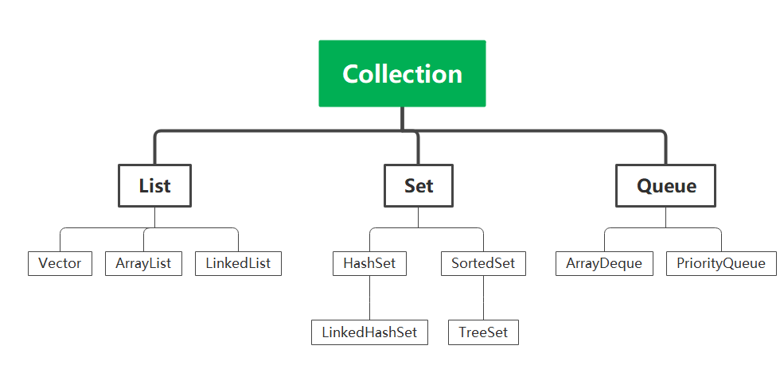
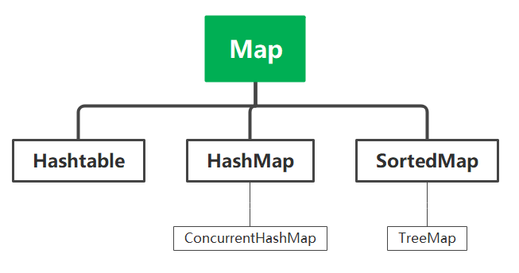

# 1、集合概述

Java里面所说的集合容器又两个接口派生而来，Collection和Map。Collection用于存储对象数据，而Map用于存储Key-value键值对类型的数据。在Collection下，又根据不同的需求有三个接口:List,Set,Queue。其中List用于存储有序可重复的对象，Set用于存储无序不可重复的对象，Queue指的是队列。然后在Map下，分为Hashtable,HashMap,TreeMap。下面针对具体的每个接口下的类作更深入的介绍。

 

 

# 2、List接口下的集合类

## 2.1 概述

List接口下的集合类主要包括：Vector,ArrayList,LinkedList。它们的区别是

Vector是List的古老实现方式，是线程安全的，因为它的很多方法都加了synchronized关键字。

ArrayList是List的主要实现类，是线程不安全的，它的底层数据结构是数组。

LinkedList也是线程不安全的，内部实现是双向链表。

## 2.2 ArrayList和LinkedList的区别

- 是否是线程安全的：两者都是线程不安全的。

- 底层数据结构：ArrayList是数组，LinkedList是双向链表
- 是否支持随机存取：ArrayList接口实现类RandomAccess接口，支持随机存取。但是这个接口只是作为一个**标志**而已，真正可以随机存取的原因是ArrayList的底层数据结构是数组，在存储时，存储的是数组的首地址，然后我们可以根据下标和对象占用的内存字节数就可以计算出目标index的地址，然后进行存取。LinkedList的存取只能按照顺序进行存取。
- 插入和删除的时间复杂度：对于ArrayList,如果是在数组尾部进行插入，那么时间复杂度是O(1), 如果是在某个index位插入，则需要移动该Index之后的对象，然后再进行插入，事件复杂度为O(n)，并且ArrayList的插入还涉及一个扩容的问题。对于LinkedList，如果再开头和结尾添加的话时间复杂度为O(1),如果是在某个index处添加，则需要找到该位置然后再插入。
- 占用内存空间： ArrayList的内存占用在于需要预留空间，LinkedList则是除首尾节点外的其它节点都需要多两个指针来存储其前驱和后继节点。

### 2.2.1 ArrayList的扩容

当数组容量不足以容纳需要添加的对象时，有一个grow()函数来进行扩容，扩容为原来容量的1.5倍。

# 3、Set接口下的集合类

## 3.1 概述

Set接口下的集合类主要包括HashSet，LinkedHashSet，TreeSet.我们知道Set存储的是无序不可重复的对象，那么这里的无序指的是什么呢？不可重复又是怎样实现的呢？

> **无序：**无序并非我们传统意义上的大小顺序，而是指不是按照我们添加对象到容器的顺序进行存储的，就是存好之后我们也不知道添加顺序是怎样的。

> **不可重复的实现：**
>
> 当添加对象时，首先会计算对象的hash值，然后和n-1做与运算找到具体的存储地址(n表示容器的容量)，然后去找之前是否有相同hash值的对象被添加到容器中。如果没有，就默认这个对象之前没有被添加过。如果有，就调用equals方法对比对象的内容是否一样，如果返回true,就说明添加重复了，如果返回false，说明没有，将该对象添加到该index位置的链表后面。

## 3.2 HashSet

HashSet是Set的主要实现类，它的底层实现和HashMap一样。就是用来普普通通存储无序不可重复的对象。保证不可重复就是像上面那样。

## 3.3 LinkedHashSet

LinkedHashSet就是为了保证有序性（知道插入的顺序）在HashSet的基础上添加一个链表。

## 3.4 TreeSet

TreeSet是可以根据需要指定按某种方式进行排序的Set实现类。这里有两种方式来指定排序方式。(即定制排序)

- 容器要保存的对象的那个类要实现Comparable接口，重写compareTo()方法。如：

```java
public class Person implements Comaparable<Person>{
	private String name;
    private int age;
    @Override
    public int compareTo(Person p){
        if(this.age>p.getAge()){
            return 1;
        }else if(this.age<p.getAge()){
            return -1;
        }
        return 0;
    }
}
```

- 传入Comparator对象

```java
ArrayList<Person> arraylist = new ArrayList<>();
Collections.sort(arraylist,new Comparator<Person>(){
	@Override
    public int compare(Person p1,Person p2){
        if(p1.getAge()>p2.getAge()){
            return 1;
        }else if(p1.getAge()<p2.getAge()){
            return -1;
        }
        return 0;
    }
})
```

# 4、PriorityQueue

- 二叉堆。底层是可变长数组。通过堆的上沉和下浮实现在O（logn)时间复杂度内插入和删除元素。

- 非线程安全，不能存储NULL对象和不可对比的对象(因为PriorityQueue需要排序)。
- 默认是小顶堆。

# 5、Map接口

## 5.1 概述

Map接口存储的是键值对类型的数据，其下的主要实现类：Hashtable,hashMap,concurrentHashMap,TreeMap.

## 5.2 Hashtable和HashMap的区别

- 底层数据结构：Hashtable底层数据结构是数组+链表。对于HashMap, jdk1.8之前底层数据结构也是数组+链表，jdk1.8之后底层数据结构变成了数组+链表+红黑树。

> <font color = 'red'>为什么要引入红黑树呢？</font>
>
> 为了查询速度。仅使用链表结构来解决哈希冲突时，当我们要查找某一个key对应的节点时，首先需要找到它所在的链表的头结点(通过计算key的哈希值，然后hash&n-1定位)，然后对当前链表进行遍历。时间复杂度为O(n)。但是当链表长度过长(就是碰撞有点多了)，查询就很慢。使用红黑树可以加快查询速度。
>
> <font color = 'red'>红黑树是什么呢？</font>
>
> 自平衡二叉查找树，不要求完全平衡，查找、插入、删除的时间复杂度都是O(logn)
>
> <font color = 'red'>引入红黑树之后什么情况下链表会转成红黑树呢?</font>
>
> 当数组某个位置的链表长度大于8，并且数组长度大于64，链表就要转成红黑树。如果数组长度此时小于64，就扩容而不转红黑树。当红黑树节点个数小于6，又要rehash成链表。

- 是否线程安全：Hashtable是线程安全的，因为它的底层实现中的方法都用了synchronized关键字。但是它这种加锁方式对于并发不太友好，一般不用它，而是用concurrentHashMap。HashMap不是线程安全的。
- 效率：因为Hashtable有一个枷锁的机制，所以效率相对低一点。
- 是否能存储null的key和value：Hashtable不能存储null的key和value，而HashMap可以，当然它只能存一个key为null的键值对。
- 扩容机制：Hashtable的初始默认容量是11，扩容是扩成2n+1。HashMap的初始默认容量是8(如果指定了容量，那么会自动将容量转成大于等于指定容量的最小的那个2的指数，比如指定容量7，那么会生成一个容量为8的Node数组，如果指定12，则会生成一个容量为16的Node数组)。然后当Node数组被占用的位置大于了总容量*填充因子或者链表长度大于8了但是数组容量小于了64，就会扩容，扩容为原来容量的2倍。

> <font color = 'red'>为什么初始容量是8呢？</font>
>
> 个人认为首先，当初始容量比较小的时候，容易产生大量碰撞或者多次扩容。而当初始容量比较大的时候，就容易浪费。
>
> <font color = 'red'>为什么容量必须是2的x次方呢？</font>
>
> 原因就是我们的哈希算法计算出来的哈希值的整体范围是很大的，但是我们对于一个容量固定的集合怎么根据哈希值找到它具体存放的位置呢？一个很直观的方法就是对集合容量取模。然后如果容量为n（n是2的x次方)，那么hash mod n相当于hash & n-1；而&是二进制运算，效率更高。
>
> <font color = 'red'>HashMap并发场景下会出现什么情况呢?</font>
>
> 死循环。原因在于rehash的过程中指针的变换造成的。

## 5.3 Hashtable和ConcurrentHashMap的区别

Hashtable和ConcurrentHashMap都是线程安全的Map。但是两者实现线程安全的方式不一样。Hashtable是使用synchronized关键字修饰其中的方法，因此相当于对整个map进行枷锁，并发效率不高。

ConcurrentHashMap在jdk1.8以前，采用的是segment数组+链表的方式，也就是将整个数组分成多个部分，加锁的时候是对对应的segment数组加锁。1.8及以后，跟随HashMap的底层有了变化，即Node数组+链表+红黑树。加锁的时候是对对应的Node节点进行加锁，并发效率进一步提高

> 扩展：例如我们有10000张票，怎样才能让并发效率更高一些呢？
>
> 就可以采用ConcurrentHashMap的思想。将票分到多个Node里面。

